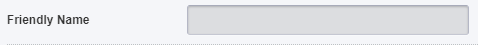

1# click
2# 
3# go to setting.json, and setting your bot
4# go to https://uptimerobot.com/ and create your Account
5# click Add New Monitor in Dashboard

in Monitor Type select HTTP(s)
6# add a name
7# copy URL in Webview and paste in
8# set like this and create
9# now click run 

Enjoy! (ˉ﹃ˉ)